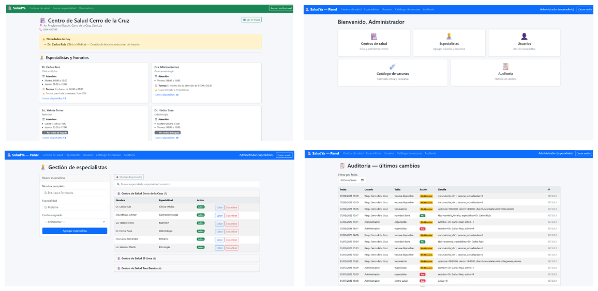

# 🏥 SaludYA — Panel de Gestión (ASP.NET Core)

Sistema web para la gestión de centros de salud públicos, construido con **ASP.NET Core 8** (Razor Pages + Web API). Combina un **sitio público** donde cualquier persona consulta especialistas, horarios y turnos disponibles, con un **panel administrativo** para gestionar centros, especialistas, usuarios, vacunas y auditoría de cambios. También expone una API REST con JWT, pensada para un cliente Android.

## 🖼️ Vista previa



*De izquierda a derecha y arriba a abajo: página pública de un centro de salud con especialistas y turnos disponibles; panel principal del administrador; gestión de especialistas por centro; y registro de auditoría con historial de cambios.*

## ✨ Funcionalidades

- **Sitio público**: cualquier persona puede buscar centros de salud, ver especialistas y sus horarios de atención, turnos disponibles y novedades del día (cambios de horario, ausencias) sin necesidad de loguearse.
- **Panel administrativo con dos roles**:
  - **Superadmin**: control total — centros de salud, especialistas, usuarios responsables, catálogo de vacunas y auditoría.
  - **Responsable**: gestiona la información de su/s centro/s asignado/s (novedades, vacunatorio, etc.).
- **Gestión de especialistas**: alta, edición, traslado entre centros y baja lógica (desactivar), agrupados por centro de salud.
- **Catálogo de vacunas y vacunatorios**: calendario oficial, campañas y stock de vacunas disponibles por centro.
- **Auditoría de cambios**: registro automático de cada alta, baja o modificación (usuario, tabla afectada, detalle, IP y fecha), filtrable por fecha.
- **Notificaciones push**: integración con Firebase para notificar novedades (`FirebaseService`).
- **API REST + Swagger**: endpoints documentados para centros, especialistas, cronogramas, dispositivos y auditoría, protegidos con JWT — usados por el cliente Android del sistema.

## 🛠️ Stack tecnológico

| Categoría | Tecnología |
|---|---|
| Backend | ASP.NET Core 8 (Razor Pages + Web API) |
| Lenguaje | C# |
| Base de datos | MySQL (MySql.Data, ADO.NET) |
| Autenticación | Cookies (panel web) + JWT Bearer (API) |
| Documentación de API | Swagger / Swashbuckle |
| Notificaciones | Firebase Cloud Messaging |
| Autorización | Políticas por rol (`SoloSuperadmin`, `ResponsableOSuperadmin`) |
| Configuración segura | dotnet user-secrets (desarrollo) |

## 📂 Estructura del proyecto

```
SaludYA-ASP.NET-Core/
├── saludya.sql            # Esquema completo de la base de datos
└── SaludYa/
    ├── Controllers/         # API REST (Centros, Especialistas, Cronograma, Auditoría, DeviceToken)
    ├── Models/                # Entidades + interfaces y repositorios (patrón Repository)
    ├── Pages/                   # Razor Pages del panel: Centros, Especialistas, Usuarios,
    │                              CatalogoVacunas, Cronograma, Novedades, Auditoria, Public, Account
    ├── Helpers/                    # Utilidades (hash de contraseñas, etc.)
    └── Program.cs                    # Configuración de servicios, auth y pipeline
```

El acceso a datos sigue el **patrón Repository**: cada entidad tiene su interfaz (`IRepositorioX`) y su implementación (`RepositorioX`), inyectadas por dependencia en `Program.cs`. La base de datos tiene 12 tablas: `centro_salud`, `especialista`, `cronograma`, `horario_cronograma`, `horario_turnos`, `novedad_diaria`, `vacunatorio`, `vacuna_disponible`, `catalogo_vacunas`, `usuario`, `device_tokens` y `auditoria`.

## 🚀 Cómo correrlo localmente

### Requisitos previos
- [.NET 8 SDK](https://dotnet.microsoft.com/download)
- MySQL Server (o XAMPP)

### Pasos

1. Cloná el repositorio:
   ```bash
   git clone https://github.com/RamonAlcaraz1987/SaludYA-ASP.NET-Core.git
   cd SaludYA-ASP.NET-Core
   ```

2. Creá la base de datos y cargá el esquema incluido:
   ```bash
   mysql -u root -p < "saludya (11).sql"
   ```

3. Configurá la cadena de conexión en `SaludYa/appsettings.json` con tus credenciales de MySQL (por defecto usa `root` sin contraseña, típico de XAMPP):
   ```json
   "ConnectionStrings": {
     "DefaultConnection": "Server=localhost;Database=saludya;User=root;Password=;"
   }
   ```

4. Configurá los secretos de la app (JWT y salt de contraseñas) con `user-secrets`, para no versionarlos en `appsettings.json`:
   ```bash
   cd SaludYa
   dotnet user-secrets init
   dotnet user-secrets set "Salt" "TU_SALT_AQUI"
   dotnet user-secrets set "TokenAuthentication:SecretKey" "TU_CLAVE_SECRETA_AQUI"
   ```

5. Restaurá dependencias y corré el proyecto:
   ```bash
   dotnet restore
   dotnet run
   ```

6. La app queda escuchando en `http://localhost:5004`. Abrí esa URL en tu navegador.

7. La documentación interactiva de la API (Swagger) está disponible en `/swagger` cuando corrés en modo desarrollo.

## 🔒 Seguridad

Las credenciales sensibles (`Salt` para el hash de contraseñas y `SecretKey` para firmar los JWT) **no están en el repositorio** — se gestionan localmente vía `dotnet user-secrets` en desarrollo, y deberían pasarse como variables de entorno en producción (por ejemplo `TokenAuthentication__SecretKey`).

## 📌 Estado del proyecto

Funcionalidades core implementadas: sitio público, panel con dos roles, gestión de especialistas/centros/vacunas, auditoría, API con JWT y manejo seguro de secretos. Próximas mejoras sugeridas:
- [ ] Agregar tests automatizados


## 📱 Proyecto relacionado

- **SaludYA-Android** — app móvil que consume la API de este panel vía JWT.

## 👤 Autor

**Ramón Alcaraz**
[LinkedIn](https://www.linkedin.com/in/ramon-alcaraz-arg/) · [GitHub](https://github.com/RamonAlcaraz1987)
